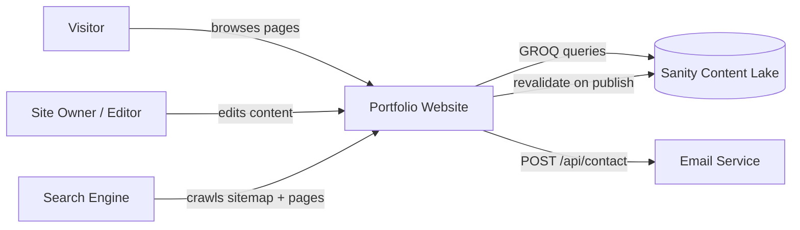
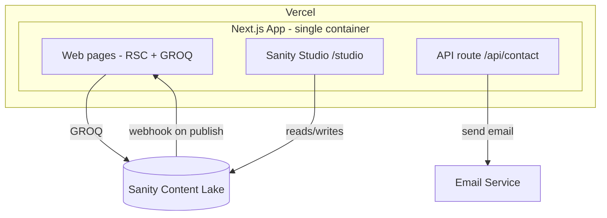

# Design: portfolio-cms

## Context

Greenfield developer portfolio site. A visitor-facing Next.js application with five pages (Home, About, Work, Services, Contact) plus a blog, where all content is authored in Sanity and published without code changes. A solo developer maintains the site and edits content through an embedded Sanity Studio.

Current state: no application code exists. The change establishes the full stack — frontend, CMS integration, contact form delivery, and SEO — as one deployable unit on Vercel.

Stakeholders: the site owner (content editor and developer), site visitors, search engines, and the email delivery service.

Constraints:
- Next.js 15 (App Router), TypeScript, Tailwind CSS v4, shadcn/ui.
- Sanity as the content source with an embedded Studio at `/studio`.
- ISR-based publishing; no live preview in this change.
- Light + dark theme, English only, no analytics.
- Deployment on Vercel with environment-variable configuration.

## Goals / Non-Goals

**Goals:**
- All site content (pages, projects, services, blog, settings, contact info) editable in Sanity without redeploying.
- Fast static pages with ISR so published edits appear quickly.
- Single deployable unit: website + embedded Studio + API routes on Vercel.
- Contact form delivers messages to the owner's inbox via an email service.
- Built-in SEO (metadata, sitemap, robots, OpenGraph) with minimal maintenance.
- Clean separation between content contracts (Sanity schemas + GROQ) and UI components.

**Non-Goals:**
- Live preview / visual editing of drafts in the frontend (deferred).
- Analytics, multi-language/i18n, and third-party auth beyond Sanity Studio access.
- Migration of existing data — greenfield with no legacy content.
- A separate Studio deployment or custom CMS beyond Sanity.

## Decisions

### D1: Next.js 15 App Router with TypeScript
Rationale: Server Components and the metadata API map directly to the SEO and ISR requirements; TypeScript gives typed content models. Alternative considered: pages router (no RSC benefits, metadata API is more manual) — rejected.

### D2: Embedded Sanity Studio at `/studio`
The Studio runs inside the same Next.js app via the `sanity` package (with `@sanity/next` helpers), mounted as a route. Rationale: one repo, one deployment, one environment for the owner. Alternatives: separate Studio app (more ops, no benefit at this scale) and hosted manage-only (weaker integration) — rejected.

### D3: Data fetching via GROQ with ISR
All reads use `@sanity/client` with GROQ against the Content Lake, with `next: { revalidate }` on page fetches and `revalidatePath` triggered by a Sanity webhook on publish. Rationale: static generation with fast refresh without redeploys. Alternatives: client-side fetch (loses static caching) and full on-demand revalidation per request (over-engineering) — rejected.

### D4: Content model as six document types
`project`, `service`, `about`, `site-settings` (singleton), `contact-info` (singleton), `blog-post`. All live in one dataset with Sanity's built-in draft/publish. Rationale: maps 1:1 to proposal capabilities; singletons prevent duplicate settings. Alternative: fewer types with generic "content blocks" — rejected for discoverability and schema validation.

### D5: Contact form -> API route -> email service
Client form with validation posts to a route handler (`/api/contact`) that sends email via an external service (e.g. Resend) using an API key env var. Rationale: reliable delivery to owner inbox, no storage in Sanity. Alternative: storing submissions as a Sanity document type — rejected (owner wants email delivery; avoids admin inbox fatigue).

### D6: Tailwind v4 + shadcn/ui with CSS-variable theming
Theme via CSS variables toggled by `next-themes`; components from shadcn/ui. Rationale: fast iteration, accessible defaults, dark mode out of the box. Alternative: hand-rolled design tokens — rejected for speed and consistency.

### D7: SEO via platform APIs
`generateMetadata` per route, `sitemap.ts`, `robots.ts` (disallowing `/studio`), OpenGraph images. Rationale: zero extra dependencies, content-driven metadata. Alternative: third-party SEO library — rejected as unnecessary.

## Risks / Trade-offs

- [Sanity webhook revalidation is brittle if misconfigured] -> Validate webhook signing; fall back to time-based revalidation (`revalidate: 300`) so content still refreshes without the webhook.
- [Embedded Studio couples CMS admin to the public app's deployment] -> Studio route is static and auth-gated; a separate Studio can be extracted later without schema changes.
- [GROQ queries drift from schema changes] -> Single typed content client module centralizes queries; schema changes update it in one place.
- [ISR serves stale content briefly after publish] -> Acceptable for a portfolio; webhook revalidation keeps the window to seconds.
- [Email service adds an external dependency for the contact form] -> Email provider is swappable behind the API route; failure surfaces a clear error to the visitor with retry.

## Migration Plan

No existing system to migrate. Deployment steps:
1. Scaffold the Next.js app and install dependencies.
2. Create the Sanity project via the Sanity CLI; wire `SANITY_PROJECT_ID`, `SANITY_DATASET`, and an API token into `.env.example`.
3. Deploy to Vercel; configure env vars and the Sanity publish webhook pointing at the revalidation route.
4. Rollback: revert to the previous Vercel deployment; content remains intact in Sanity.

## Open Questions

- Exact email service choice (Resend vs alternative) and its API-key env var name.
- Domain name for the production site (affects metadata and canonical URLs).
- Sanity project/dataset naming convention.
- Whether the site owner has a UI design pattern (layouts, spacing, typography) to apply — to be captured when provided, without changing this architecture.